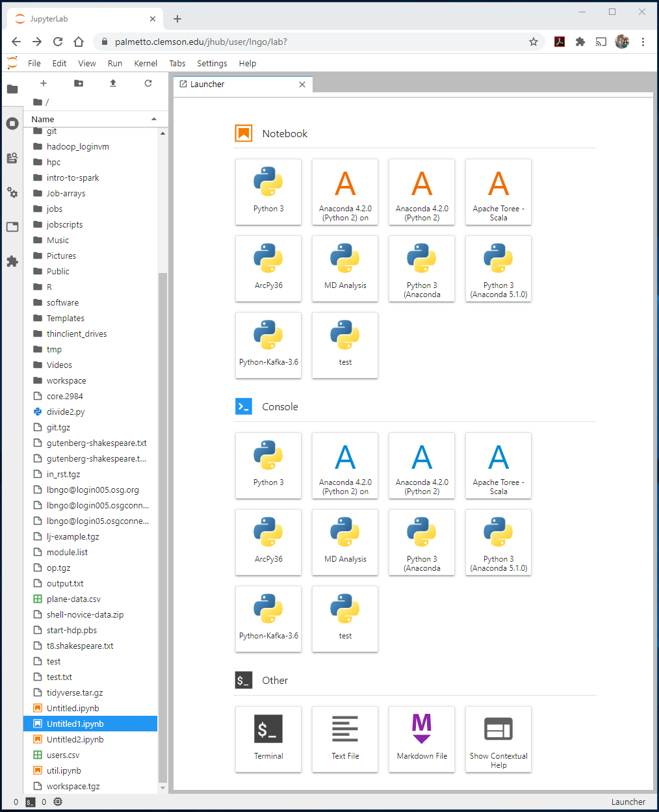
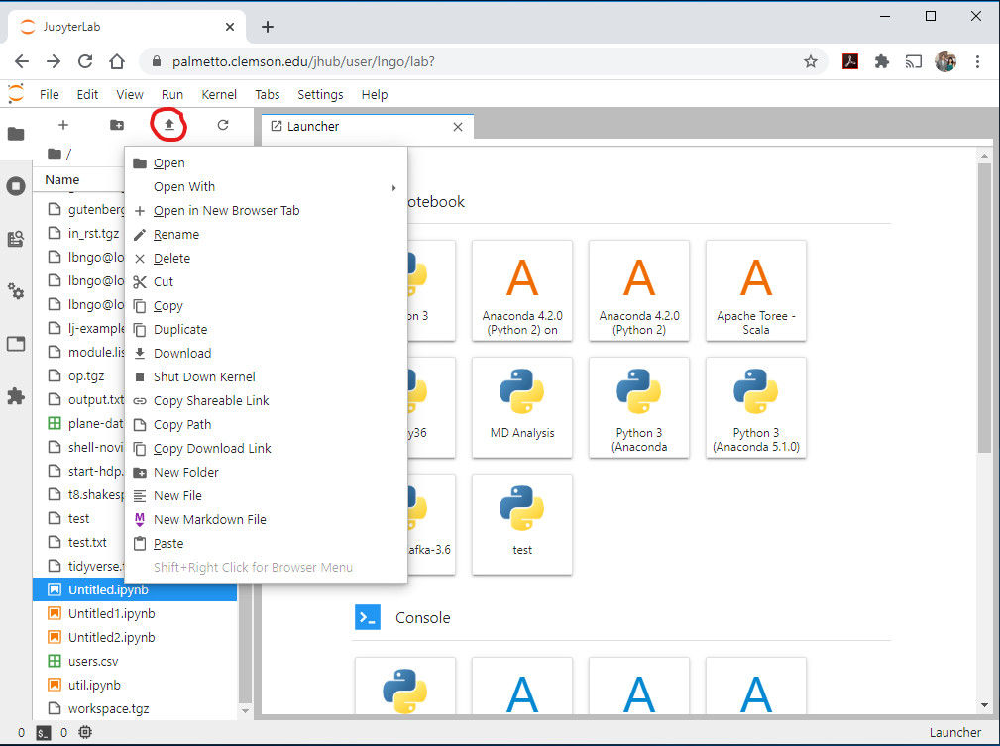
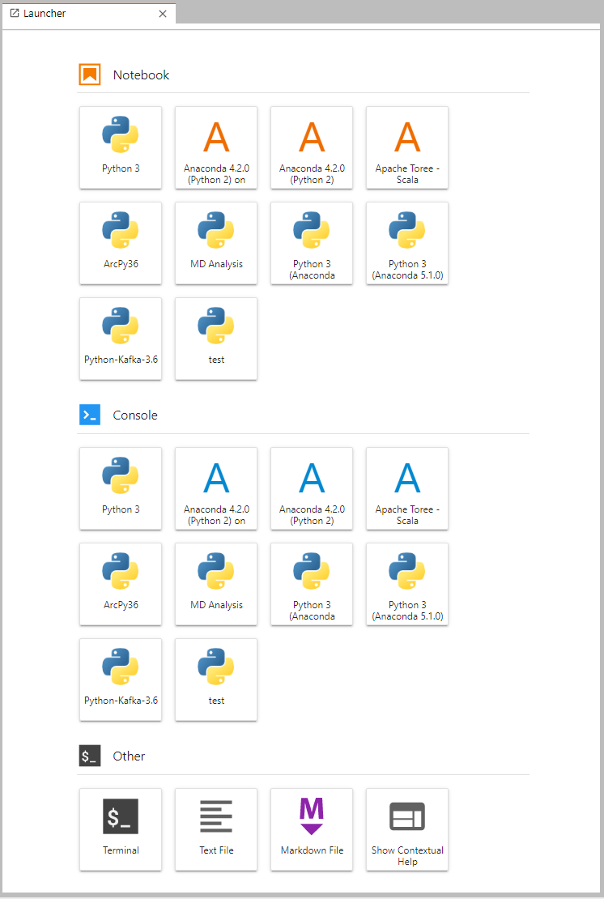
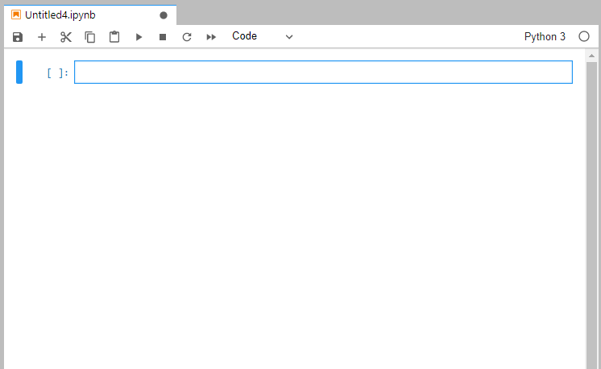
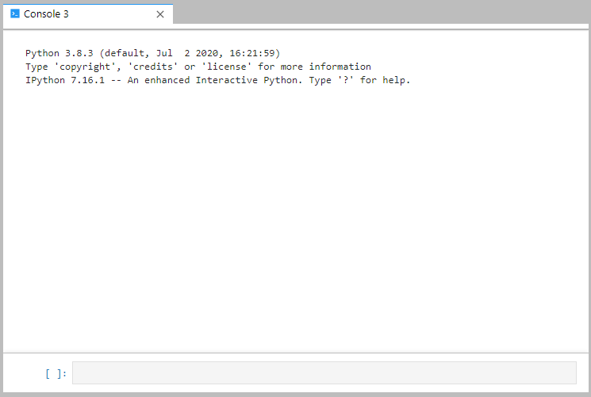
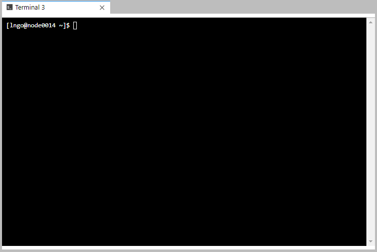
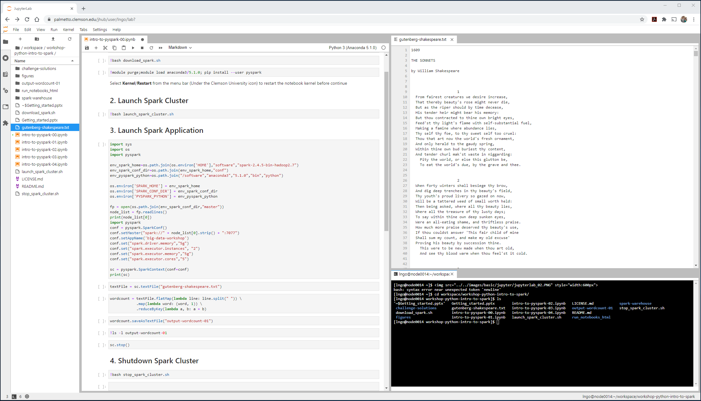

### JupyterLab dashboard

After your Jupyter server successfully launched on Palmetto, your browser will present you
with a JupyterLab dashboard. 

The dashboard is the primary interface of the notebook server. We are using the JupyterLab 
version of the dashboard to allow users more control over the notebook workspace inside the 
browser. 

### Files and folders

- The files and folders are shown on the left vertical partition of the JupyterLab dashboard. 
Right-click on a file or folder will give you a number of operational options, as shown in
the figure below. 

- To upload **small** files from your computer to Palmetto via the dashboard, click on the bold
up arrow at the top of the file/folder areas (the red circle). 

### Launchers

- Launchers are tabs internal to the browser presenting the JupyterLab dashboard. Launcher 
resperents a significant change to the traditional one-browser-tab-per-notebook/terminal 
presentation of Jupyter Notebook. 
- On Palmetto, there are three types of Launchers: `Notebook`, `Console`, and `Other`. 
- `Other` includes browser-based terminal, text editors, and markdown editor. 

- The `Notebook` launcher will list all available Jupyter notebook kernels that your account 
has. 
- Click on a kernel will launch the corresponding notebook in the current launcher tab. 

- The `Console` launcher will launch a command-based interface for the available Jupyter notebook 
kernels that your account has (note the similar list as the `Notebook launcher`). 

- An example of a terminal launcher tab is shown below, from the `Other` launcher. 

The most significant impact of the JupyterLab dashboard is its ability to **rearrange multiple launcher tabs** within the same browser, similar to a typical programming IDE. By dragging the 
tabs around, you can have a versatile work environment. 

