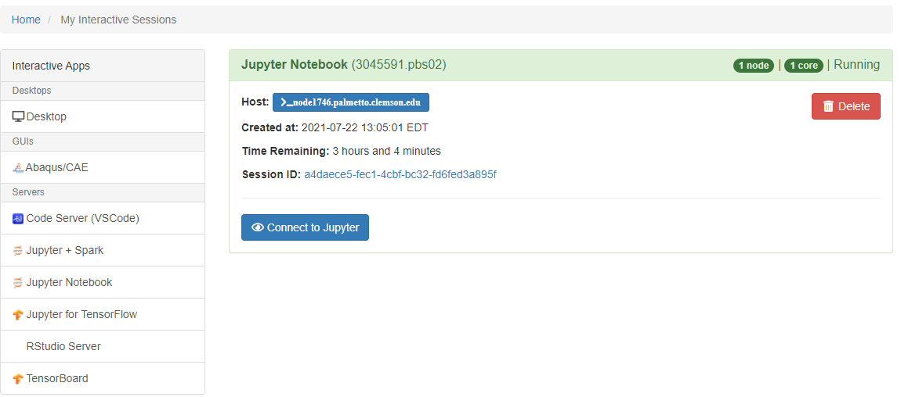

### JupyterLab on the Palmetto Cluster

OpenOD allows users to interact with the Palmetto cluster
from their web browsers using the [Jupyter Lab](http://jupyter.org/) interface,
and to prototype and develop code in **Python**, **R**, **MATLAB** and several other languages.

### Launching a Jupyter Server on Palmetto

1. Go to the [OpenOD website](https://openod02.palmetto.clemson.edu/).
2. Log in with your Palmetto user ID and password:
3. Once you are logged in, click on **Interactive Apps** on the top navigation bar.
4. Click on the **Jupyter Notbook** link.

5. Select the resources (CPU cores, memory, walltime, etc.,) required for your session.

6. Once you launch your server you will be taken to your [current list of interactive sessions](https://openod02.palmetto.clemson.edu/pun/sys/dashboard/batch_connect/sessions "current list of interactive sessions"). Your job will be queued until resources are available to handle your request.

7. Once your server has had it's resources allocated you can connect to your server with a button that says `Connect to Jupyter`, your browser will then be sent to the JupyterLab **dashboard**.

