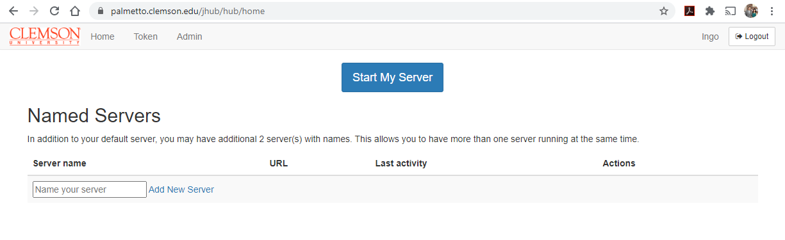
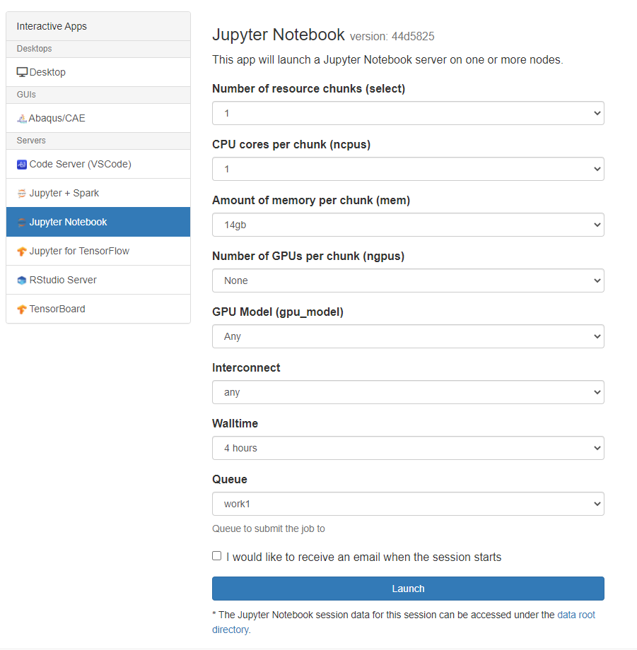

### Jupyter Lab on the Palmetto Cluster

JupyterHub allows users to interact with the Palmetto cluster
from their web browsers using the [Jupyter Lab](http://jupyter.org/) interface,
and to prototype and develop code in **Python**, **R**, **MATLAB** and several other languages.

### Launching a Jupyter Server on Palmetto

1. Go to the [OpenOD website](https://openod02.palmetto.clemson.edu/).
2. Click on the **JupyterHub** link. 
3. Log in with your Palmetto user ID and password:
4. Once you are logged in, click on "Interactive apps" on the top navigation bar.

5. Select the resources (CPU cores, memory, walltime, etc.,) required for your session.

6. If the resources you request are available, a notebook server will be started for you.
It is in fact a job submitted to Palmetto under your username. 

7. When resources are allocated and the Jupyter server finished launching, your browser
will show the JupyterLab **dashboard**.

