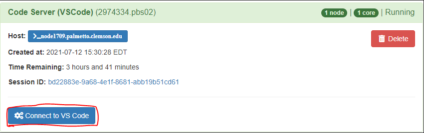
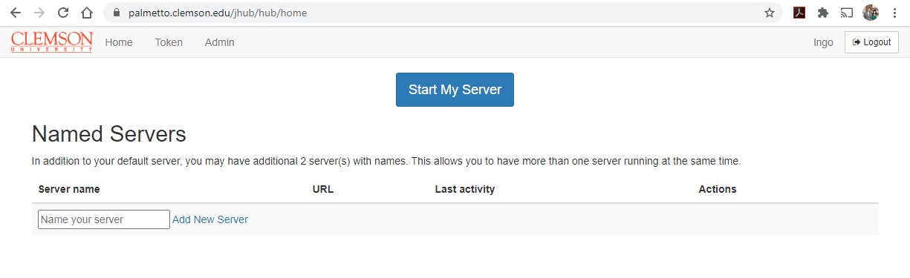
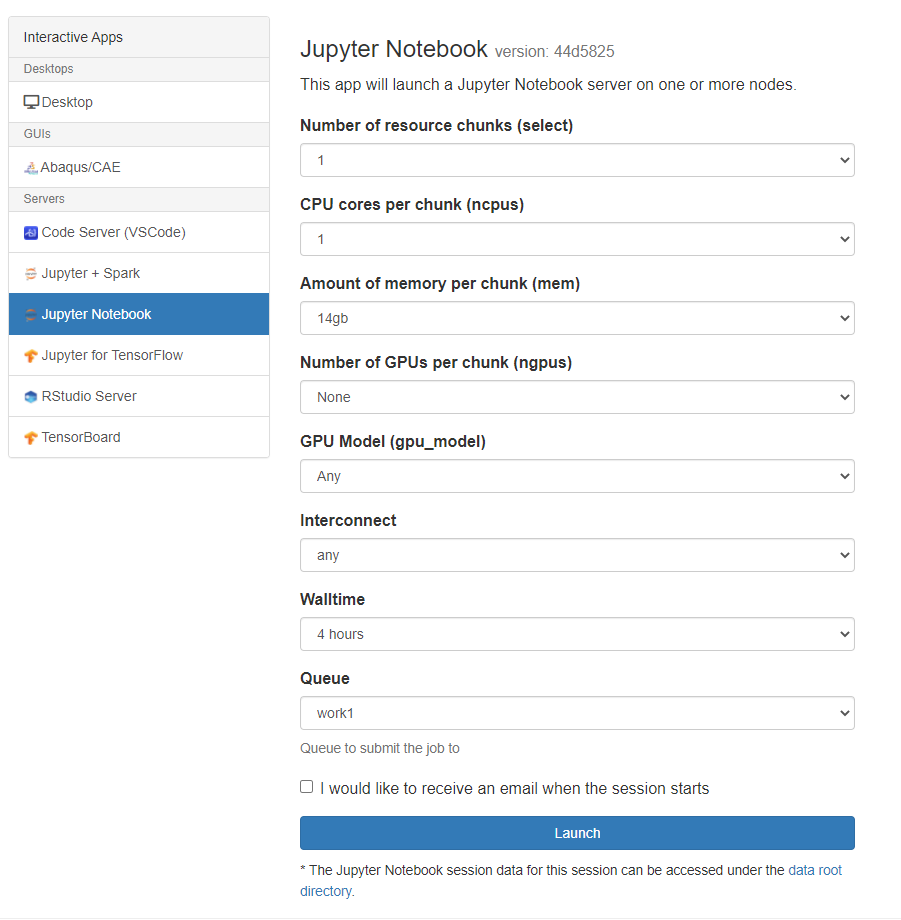
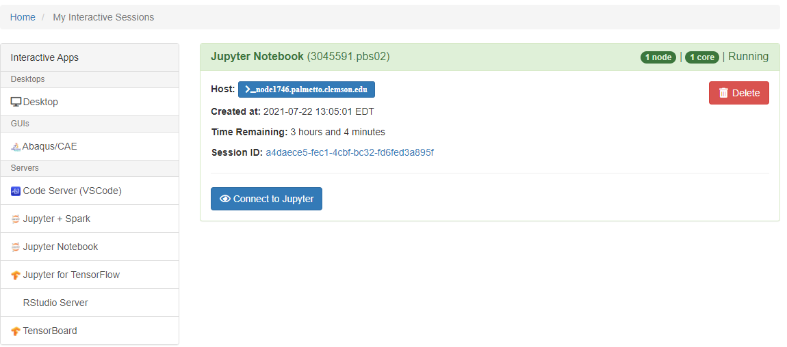

## Spark with Jupyter Notebook Server

OpenOD has pre-configured jupyter sessions when working with the [spark](https://spark.apache.org/docs/0.9.1/index.html) python library.

When selecting an application from the interavtice app tab select Jupyter with spark

Once you have arrived at the server configuration page, select the resources (CPU cores, memory, walltime, etc.,) required for your session. Here you can also choose what version of spark you would like to use.

Once you launch your server you will be taken to your [current list of interactive sessions](https://openod02.palmetto.clemson.edu/pun/sys/dashboard/batch_connect/sessions "current list of interactive sessions"). Your job will be queued until resources are available to handle your request. Once that has happened you will be able to connect to your Jupyter server with a button.

## Launching a Jupyter Server on Palmetto

1. Go to the [OpenOD website](https://openod02.palmetto.clemson.edu/).
2. Click on the **JupyterHub** link. 
3. Log in with your Palmetto user ID and password:
4. Once you are logged in, click on "Interactive apps" on the top navigation bar.

5. Select the resources (CPU cores, memory, walltime, etc.,) required for your session.

6. If the resources you request are available, a notebook server will be started for you.
It is in fact a job submitted to Palmetto under your username. 

7. When resources are allocated and the Jupyter server finished launching, your browser
will show the JupyterLab **dashboard**.

