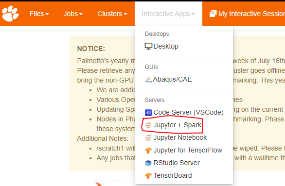
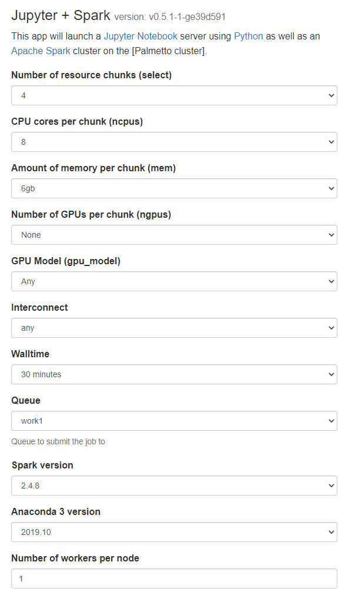
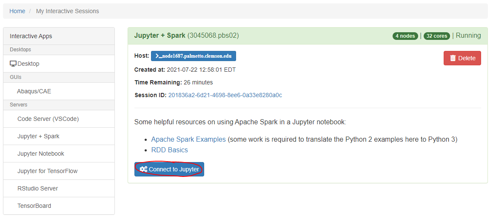
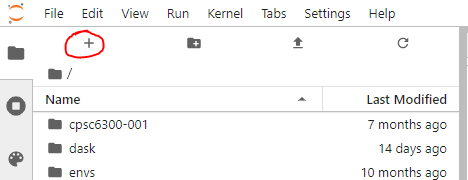
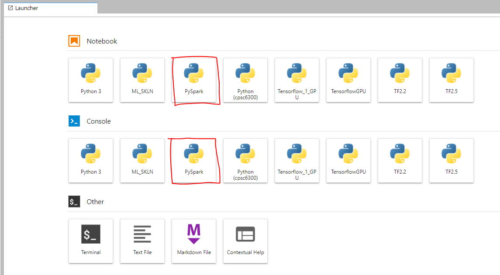
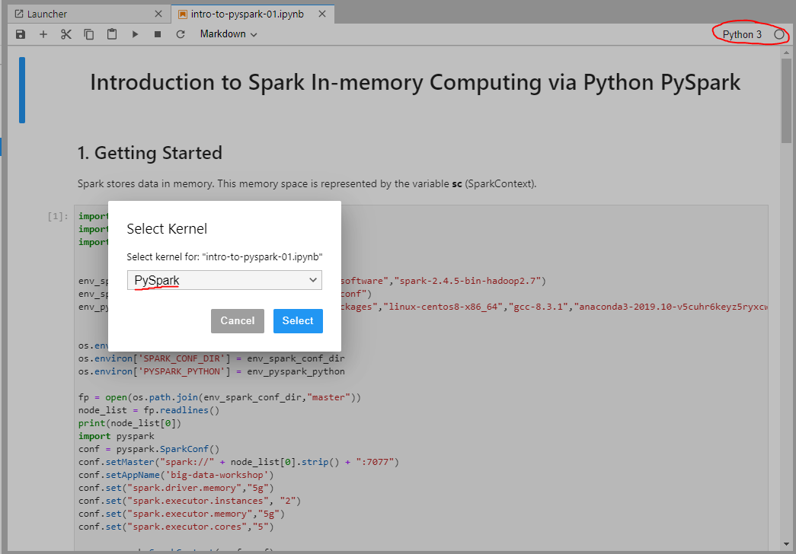

## Spark + Jupyter

OpenOD has the ability to use the Python [Spark](https://spark.apache.org/docs/0.9.1/index.html) library by using pre-configured JupyterLab sessions. Currently, Spark versions `2.4.8` and `3.1.2` are available on Palmetto

Spark is a high-level cluster computing system that has binding for Python. It can be used to write programs that utilize parallelization for faster computation when working with big data or machine learning.

### Launching a Jupyter Lab Server with spark on Palmetto

1. Go to the [OpenOD website](https://openod02.palmetto.clemson.edu/).
2. Log in with your Palmetto user ID and password:
3. Click on **Jupyter + Spark** link under Interactive Apps on the top navigation bar. 

4. Once you have arrived at the server configuration page, select the resources (CPU cores, memory, walltime, etc.,) required for your session. When using spark you usually want more than 1 resource chunk.
 Here you can also choose what version of spark you would like to use.

Once you launch your server you will be taken to your [current list of interactive sessions](https://openod02.palmetto.clemson.edu/pun/sys/dashboard/batch_connect/sessions "current list of interactive sessions"). Your job will be queued until resources are available to handle your request. Once that has happened you will be able to connect to your Jupyter server with a button.

5. your browser will then be sent to the JupyterLab **dashboard**.

### Running Python with spark

When arriving to the Jupyter Lab dashboard you can either open an existing notebook using the file browser or create a new one with the launcher.

The launcher can be accessed by clicking the plus sign ``(+)`` at the top left of the dash board

From the launcher you can start a notebook or a Python terminal using the spark kernel. The Python kernel with spark  will be named ``PySpark``.

After clicking these you will be put into a Notebook or Console that is running the python + Spark kernel.

You can also change the kernel of an existing notebook to the Spark kernel by clicking on the kernel name at the top right of the notebook and selecting ``PySpark`` on the dropdown menu for kernels.

 

You can get started with programming with Python + Spark at the offical [Spark docs](https://spark.apache.org/docs/0.9.1/python-programming-guide.html)