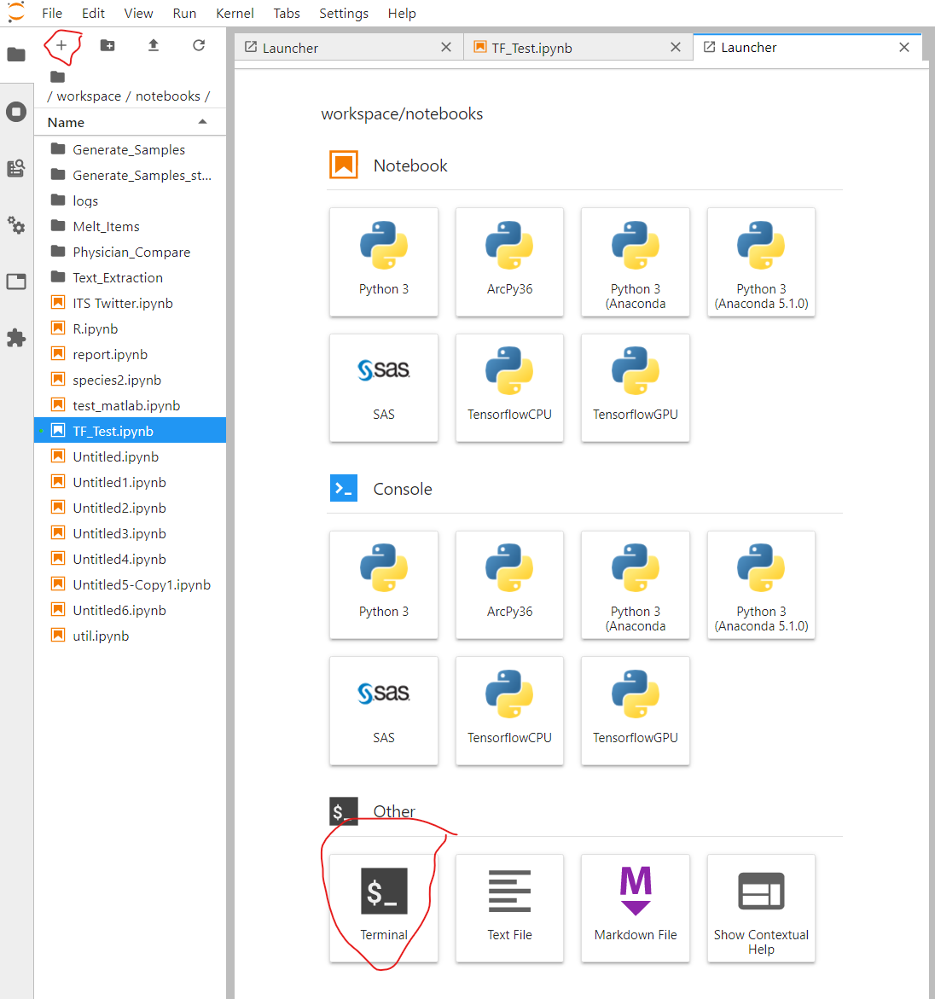
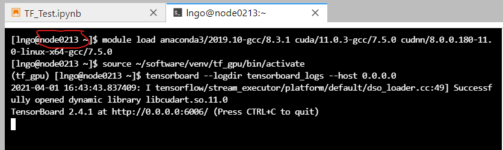
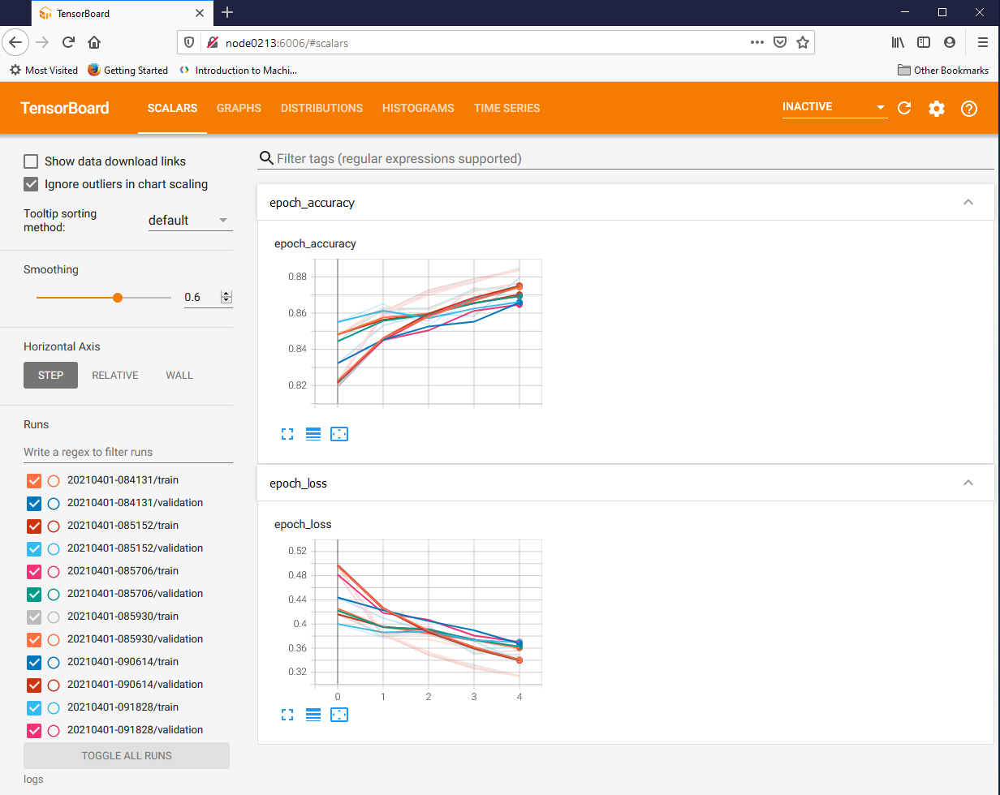

## Tensorboard

TensorFlow 2+ has `tensorboard` included with the installation package. To run TensorBoard, 
you can leverage the same notebook server. 

1) Click the `+` sign near the top left corner of the Jupyter Lab interface to open the Launcher. 
Select a Terminal. 

2) Run the following commands (assuming a `tf_gpu` installation.)

~~~
$ module load anaconda3/2019.10-gcc/8.3.1 cuda/11.0.3-gcc/7.5.0 cudnn/8.0.0.180-11.0-linux-x64-gcc/7.5.0
$ source ~/software/venv/tf_gpu/bin/activate
$ tensorboard --logdir logs --host 0.0.0.0
~~~

Pay attention to your allocated Palmetto node, as highlight by the red shape in the above
image. 

3) Follow the instructions shown in [Socket Proxy Access](https://www.palmetto.clemson.edu/palmetto/advanced/proxy/) to setup proxy access from your local computer. Open the Firefox browser and go to the node from step
2 at port 6006

