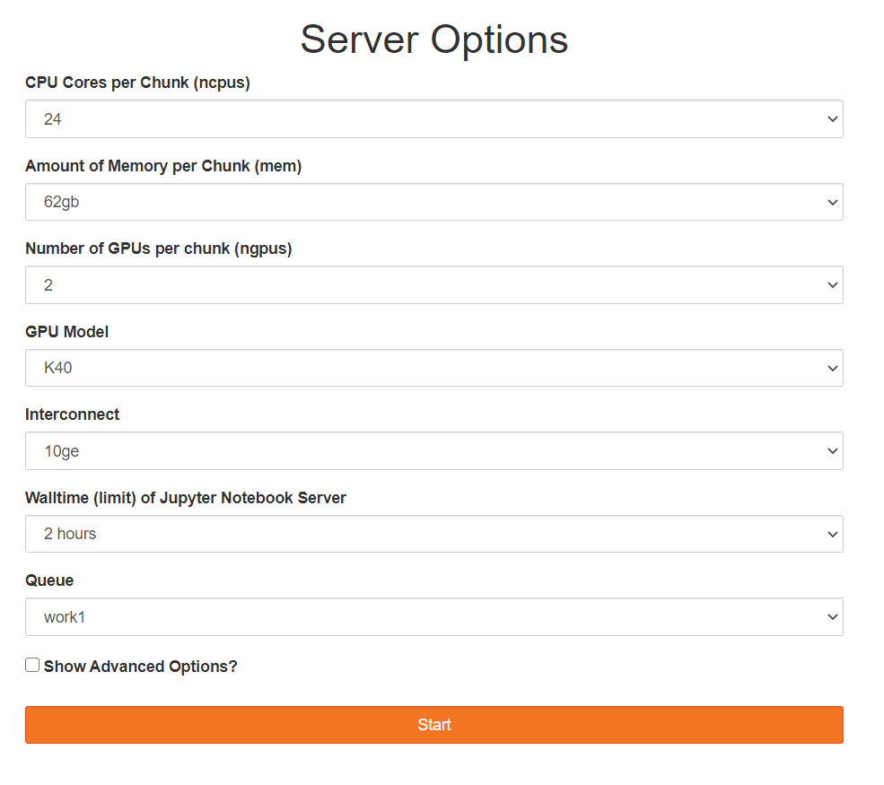
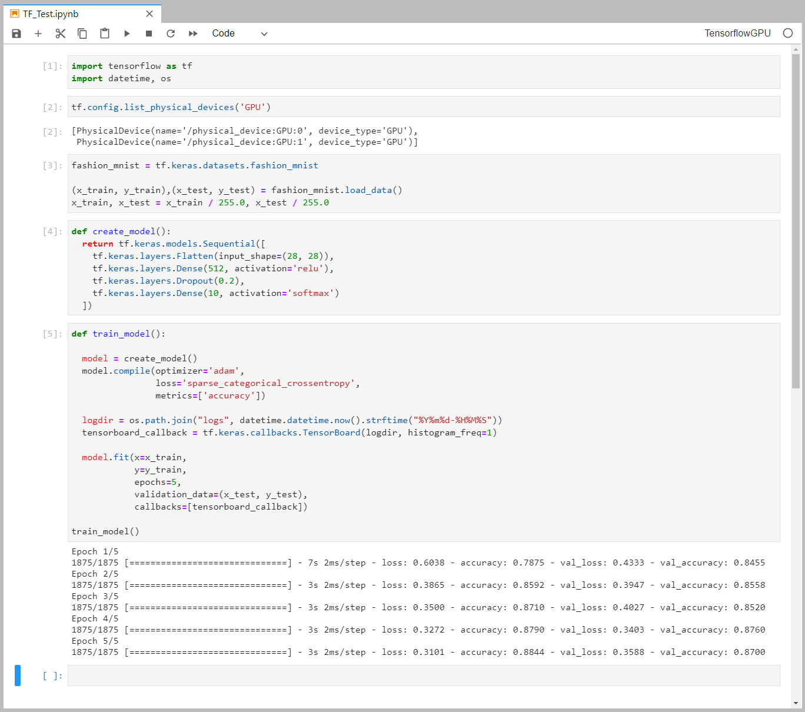

## Tensorflow

This page explains how to install the [TensorFlow](https://www.tensorflow.org/)
package for use with GPUs on the cluster,
and how to use it with OpenOD via [Jupyter Lab](https://www.palmetto.clemson.edu/palmetto/openondemand/apps/jupyter.html).

This guide is created primarily for TensorFlow 2+. This version of TensorFlow requires AVX2 support 
from CPU, which is not available on the older nodes. Currently Palmetto nodes from **Phase 12 and up** support AVX2. 

If you are using codes built using TensorFlow 1, please refer to 
this [migration documentation](https://www.tensorflow.org/guide/migrate) to help with your code. 

### Installing TensorFlow GPU node

1) Request an interactive session on a GPU node. For example:
~~~
$ qsub -I -l select=1:ncpus=24:mem=125gb:ngpus=2:gpu_model=k40:interconnect=10ge,walltime=72:00:00
~~~

2) Load the Anaconda module:
~~~
$ module load anaconda3/2019.10-gcc/8.3.1 cuda/11.0.3-gcc/7.5.0 cudnn/8.0.0.180-11.0-linux-x64-gcc/7.5.0
~~~

3) Create a directory to store the Python virtual environment packages:

~~~
$ mkdir -p ~/software/venv
$ python3 -m venv --system-site-packages ~/software/venv/tf_gpu
~~~

4) Activate the virtual environment:

~~~
$ source ~/software/venv/tf_gpu/bin/activate
~~~

5) Install TensorFlow:

~~~
$ pip install --upgrade pip
$ pip install tensorflow==2.4
~~~

This will automatically install some packages that are required for Tensorflow, like SciPy or NumPy. 
If you need additional packages (for example, Pandas), you can type

~~~
$ pip install pandas
~~~

6) Install TensorFlow Jupyter Kernel and add the required libraries to the jhubrc file. More info on the jhubrc file can be found [here](https://clemsonciti.github.io/jupyter-docs/Configuring.html).

~~~
$ python3 -m ipykernel install --user --name tf_gpu --display-name TensorflowGPU
$ echo "module load anaconda3/2019.10-gcc/8.3.1 cuda/11.0.3-gcc/7.5.0 cudnn/8.0.0.180-11.0-linux-x64-gcc/7.5.0" >> ~/.jhubrc
~~~

### Installing TensorFlow for non-GPU node

1) Request an interactive session without GPU specification. For example:

~~~
$ qsub -I -l select=1:ncpus=24:mem=125gb:interconnect=10ge,walltime=72:00:00
~~~

2) Load the required modules

~~~
$ module load cuda/10.2.89-gcc/8.3.1
~~~

3) Create a directory to store the Python virtual environment packages:

~~~
$ mkdir -p ~/software/venv
$ python3 -m venv --system-site-packages ~/software/venv/tf_cpu
~~~

4) Activate the virtual environment:
~~~
$ source ~/software/venv/tf_cpu/bin/activate
~~~

5) Install TensorFlow:
~~~
$ pip install --upgrade pip
$ pip install tensorflow==2.4
~~~

This will automatically install some packages that are required for Tensorflow, like SciPy or NumPy. 
If you need additional packages (for example, Pandas), you can type

~~~
$ pip install pandas
~~~

6) Install TensorFlow Jupyter Kernel:

~~~
$ python3 -m ipykernel install --user --name tf_cpu --display-name TensorflowCPU
~~~

### Test TensorFlow Jupyter Kernels

1) Log into [OpenOD] and click go to [interactive apps -> jupyter with tensorflow]. Make sure you have GPU in your
selection if you want to use the GPU TensorFlow kernel

2) Once your Jupyter Lab session has started, you should see the TensorFlow kernels in your list of kernels
in the Launcher.

3) You are now able to launch a notebook using the one of the TensorFlow with GPU kernel:

For Tensorflow with GPU support, the notebook cell containing `tf.config.list_physical_devices('GPU')`
will produce a non-empty list. 

### Example Deep Learning - Multiple Object Detections

This is a demonstration for the tensorflow gpu kernel. Steps for
non-gpu kernel are similar.

1) Request an interactive session on a GPU node. For example:
~~~
$ qsub -I -l select=1:ncpus=16:mem=20gb:ngpus=1:gpu_model=p100,walltime=3:00:00
~~~

2) Load the Anaconda module:
~~~
$ module load cuda/10.2.89-gcc/8.3.1 cudnn/8.0.0.180-10.2-linux-x64-gcc/8.3.1 anaconda3/2019.10-gcc/8.3.1
~~~

3) Activate the conda environment:
~~~
$ source activate tf_gpu_env
~~~

4) Install supporting conda modules:

~~~
$ conda install Cython contextlib2 pillow lxml matplotlib utils pandas
~~~

5) Setup TensorFlow's Model directory:

~~~
$ cd
$ mkdir tensorflow
$ cd tensorflow
$ wget https://github.com/tensorflow/models/archive/master.zip
$ unzip master.zip
$ mv models-master models
$ module load protobuf/3.11.2-gcc/8.3.1
$ cd models/research
$ protoc object_detection/protos/*.proto --python_out=.
$ cp object_detection/packages/tf2/setup.py .
$ python -m pip install --user --use-feature=2020-resolver .
$ cd ~/tensorflow
$ cp /zfs/citi/deeplearning/multi_object.ipynb .
~~~

Open Jupyter Server, change into the `tensorflow` directory, then open and run
the `multi_object.ipynb` notebook.
