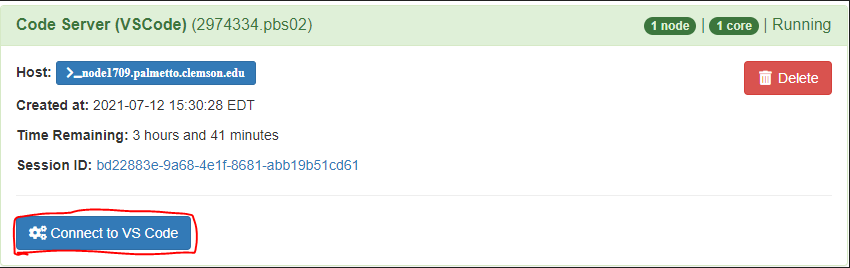
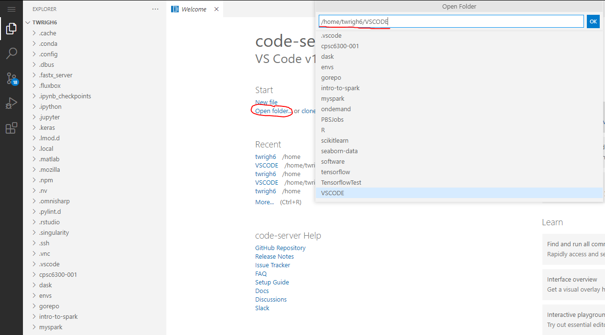

## VSCode

VSCode is a text editor and debugger for working with many different language. VSCode comes with github integration by default and allows for language specific syntax highlighting and autocomplete with IntelliSense.

Currently, [VSCode Server version 3.10.2](https://github.com/cdr/code-server "VSCode Server version 3.10.2") is available on the Palmetto cluster.

### Starting a VSCode Server
Start by heading to the [Open OnDemand website](https://openod02.palmetto.clemson.edu/ "Open OnDemand website") where on the nav bar you can find the interactive apps.

Select `Code Server (VSCode)`

Once you have selected to create a VSCode server you will be prompted with a GUI where you can choose what hardware and software your server will have.

Normally, the number of resource chunks should be `1` unless you are working with a clustered computing software.

Once you launch your server you will be taken to your [current list of interactive sessions](https://openod02.palmetto.clemson.edu/pun/sys/dashboard/batch_connect/sessions "current list of interactive sessions"). Your job will be queued until resources are available to handle your request. 

Once your resources are available you will be able to connect to your VSCode server with a button that says `Connect to Jupyter`.

If you get stuck in the queuing phase, try lowering the resources your server is using or making sure `interconnect = any` in the server request options.

### VSCode Dashboard

Once you have connect to your VSCode server you will be sent to the VSCode dashboard.
Here you can choose a directory to start working in by clicking open folder then specifying the directory.

Additionally in the VSCode server you have access to the terminal. Clicking on the context menu on the top leftmost position of the screen will bring up a menu from there you are able to open up a terminal by following the path `Terminal->New Terminal`.

Once you are in your terminal you can run any of the software that you loaded while requesting the server.
~~~
$ module avail
~~~
~~~
Currently Loaded Modules:
~~~
~~~
1) anaconda3/2019.10-gcc/8.3.1   2) libxml2/2.9.10-gcc/8.3.1   3) openmpi/3.1.4-gcc/8.3.1-ucx 
~~~
### Utilizing VSCode features

The leftmost area of the screen has a few icons where you can use some of the features of the VSCode text editor.
In order of appearence these features are :  
1) Directory browser 
2) Find and replace tool 
3) Github integration 
4) Debugger 
5) Extension marketplace 

The first item is the directory browser this is where you can create, edit, or delete files.

The second item is a find and replace tool that works throughout your entire working directory.
We can see here that searching for `return` showed up in 3 different files in our current working directory.

The third item allows VSCode to integrate with github, intially you can start a repository within your current working directory or if you are already in a git repository you can see file changes made and perform git operations. 
Here we can see that the file `readme.txt` has been added and  `Test.c` has been modified.

The fourth item is the built in debugger. The debugger requires extensions to use and compatibility with Palmetto's VSCode server is not guaranteed.

The fifth item is the extension marketplace where you can install community made extensions to modify your version of VSCode.These extensions differ from the desktop version of VSCode as some are closed source. The extensions will persist throughout vscode server sessions as they are stored in your home directory at `~/.local/share/code-server/extensions`

You can see further documentation and VSCode server specific commands at the [code server documentation website](https://coder.com/docs/code-server/v3.10.2 "code server documentation website")

