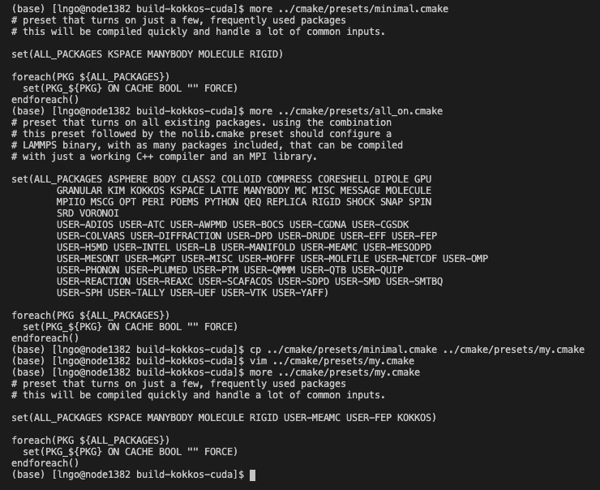
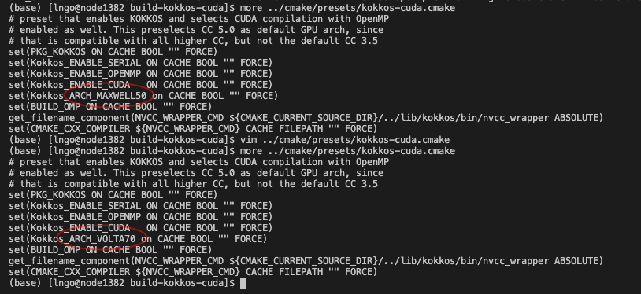
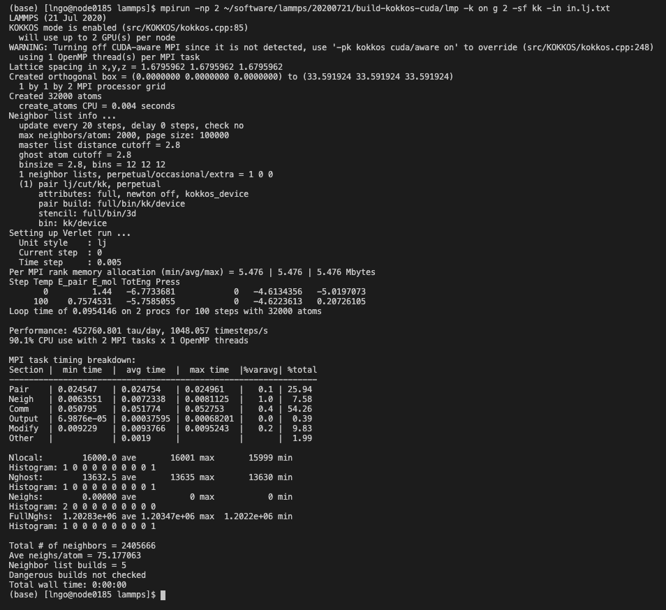

## LAMMPS

There are a few different versions of LAMMPS available on the cluster.

~~~
$ module avail lammps

------------------------- /software/ModuleFiles/modules/linux-centos8-x86_64 -------------------------
lammps/20190807-gcc/8.3.1-cuda10_2-mpi-openmp-user-omp
lammps/20200505-gcc/8.3.1-cuda10_2-kokkos-mpi-nvidia_P-openmp-user-omp
lammps/20200505-gcc/8.3.1-cuda10_2-kokkos-mpi-nvidia_K-openmp-user-omp
lammps/20200505-gcc/8.3.1-cuda10_2-kokkos-mpi-nvidia_V-openmp-user-omp (D)
~~~
Note: letter P, K, V stand for GPU pascal (p100), kepler (k20, k40) and volta (v100)

### Installing custom LAMMPS on Palmetto

LAMMPS comes with a wide variety of supported packages catering to different simulation techniques. 
It is possible to build your own LAMMPS installation on Palmetto. We discuss two examples below, one
using `kokkos` with GPU, one using `kokkos` without GPU support. 

Reserve a node, and pay attention to its GPU model.

~~~
$ qsub -I -l select=1:ncpus=24:mem=100gb:ngpus=2:gpu_model=v100:interconnect=25ge,walltime=10:00:00
~~~

Create a directory named `software` (if you don't already have it) in your 
home directory, and change to that directory. 

~~~
$ mkdir ~/software
$ cd ~/software
~~~

- Create a subdirectory called `lammps` inside `software`. 
- Download the latest version of lammps and untar. 
- **In this example, we use the 20200721, the latest dated version of lammps. 
You can set up spack (see [User Software Installation](https://www.palmetto.clemson.edu/palmetto/software/spack/)), 
then runs `spack info lammps` to see the latest recommended version of lammps.** 
- You can change the name of the untarred directory to something easier to manage. 

~~~
$ mkdir lammps
$ cd lammps
$ wget https://github.com/lammps/lammps/archive/patch_21Jul2020.tar.gz
$ tar zfs path_21Jul2020.tar.gz
$ mv lammps-path_21Jul2020 20200721
~~~

In the recent versions, lammps use cmake as their build system. As a result, we will be able to 
build multiple lammps executables within a single source download. 

#### Lammps build with kokkos and gpu

- Create a directory called `build-kokkos-cuda`
- Change into this directory. 

~~~
$ mkdir build-kokkos-cuda
$ cd build-kokkos-cuda
~~~

In building lammps, you will need to modify two `cmake` files, both inside `../cmake/presets/` directory (this is a
relative path assuming you are inside the previously created `build-kokkos-cuda`). A set of already prepared cmake 
templates are available inside `../cmake/presets`, but you will have to modify them. It is recommended that you use
`../cmake/presets/minimal.cmake` and `../cmake/presets/kokkos-cuda.cmake` as starting points. 

For add-on simulation packages, make a copy of `../cmake/presets/minimal.cmake`, and use `../cmake/presets/all_on.cmake` 
as a reference point to see what is needed. Let's say we want `user-meamc` and `user-fep` in addition to what's in `minimal.cmake` for simulation techniques. We also need to inlcude kokkos. 

~~~
$ more ../cmake/presets/minimal.cmake
$ more ../cmake/presets/all_on.cmake
$ cp ../cmake/presets/minimal.cmake ../cmake/presets/my.cmake
~~~

Use your favorite editor to add the necessary package names (in capitalized form) to `my.cmake`. 
Check the contents afterward. 

~~~
$ more ../cmake/presets/my.cmake
~~~

- Next, we need to modify `../cmake/presets/kokkos-cuda.cmake` so that `kokkos` is built to the correct
architectural specification. For Palmetto, the follow

Palmetto GPU architectures       |   Architecture name for Kokkos
--------------------|-------------------------------------
K20 and K40         | KEPLER35
P100                | PASCAL60
V100 and V100S      | VOLTA70

- Since we specified `v100` in the initial `qsub`, `../cmake/presets/kokkos-cuda.cmake` will need to be
modified to use `VOLTA70`. 

- We will need to load three supporting modules from Palmetto. We will load
modules that have been compiled for the specific architecture of v100 nodes. 

~~~
$ module purge
$ export MODULEPATH=/software/ModuleFiles/modules/linux-centos8-skylake:$MODULEPATH
$ module load cmake/3.17.3-gcc/8.3.1 fftw/3.3.8-gcc/8.3.1-mpi-openmp cuda/10.2.89-gcc/8.3.1 openmpi/3.1.6-gcc/8.3.1
~~~

- Build and install

~~~
cmake -C ../cmake/presets/my.cmake -C ../cmake/presets/kokkos-cuda.cmake ../cmake
cmake --build .
~~~

- Test on LAMMPS's LJ data

~~~
$ mkdir /scratch1/$USER/lammps
$ cd /scratch1/$USER/lammps
$ wget https://lammps.sandia.gov/inputs/in.lj.txt
$ mpirun -np 2 ~/software/lammps/20200721/build-kokkos-cuda/lmp -k on g 2 -sf kk -in in.lj.txt
~~~

### Running LAMMPS - an example

Several existing examples are in the installed folder: *lammps-7Aug19/examples/*
Detailes description of all examples are [here](https://lammps.sandia.gov/doc/Examples.html#).

We run an example *accelerate* using different package
Here is a sample batch script `job.sh` for this example:

~~~
#PBS -N accelerate 
#PBS -l select=1:ncpus=8:mpiprocs=8:ngpus=2:gpu_model=v100:mem=64gb:interconnect=25ge,walltime=4:00:00
#PBS -j oe

cd $PBS_O_WORKDIR
module purge
module load lammps/20200505-gcc/8.3.1-cuda10_2-kokkos-mpi-nvidia_V-openmp-user-omp

mpirun -np 8 lmp -in in.lj > output.txt        # 8 MPI, 8 MPI/GPU
# to write the output to a file
~~~

#### Lammps build with kokkos and gpu

This is a bit similar to the build with kokkos and gpu. In a non-gpu build, `kokkos` will
help manage the OpenMP threads, and the corresponding make file is `../cmake/presets/kokkos-openmp.make`

### Several way to run LAAMPS
~~~
# Running LAMMPS with KOKKOS packages using 8 MPI tasks/nodes, no multi-threading
mpirun -np 8 lmp -k on -sf kk -in in.lj > output_kokkos1.txt 

# Running LAMMPS with KOKKOS packages using 2 MPI tasks/nodes, 8 threads/tasks
mpirun -np 2 lmp -k on t 8 -sf kk -in in.lj > output_kokkos2.txt 

# Running LAMMPS with 1 GPU 
lmp -sf gpu -pk gpu 1 -in in.lj > output_1gpu.txt

# Running LAMMPS with 4 mpi task share 2 gpus on single 8 cores node
mpirun -np 4 lmp -sf gpu -pk gpu 2 -in in.lj > output_2gpu.txt

# Running LAMMPS with 1 MPI task, 8 threads
export OMP_NUM_THREADS=8
lmp -sf omp -in in.lj > output_1mpi_8omp.txt         

# Running LAMMPS with 4 MPI task, 4 OMP threads
export OMP_NUM_THREADS=4
mpirun -np 4 lmp -sf omp -pk omp 4 -in in.lj > output_4mpi_4omp.txt

# Running LAMMPS with OPT in serial mode
lmp -sf opt -in in.lj > output_opt_serial.txt

# Running LAMMPS with OPT in parallel mode
mpirun -np 8 lmp -sf opt -in in.lj > output_opt_parallel.txt
~~~

For more information on comparison between various accelerator packages please visit:
https://lammps.sandia.gov/doc/Speed_compare.html
