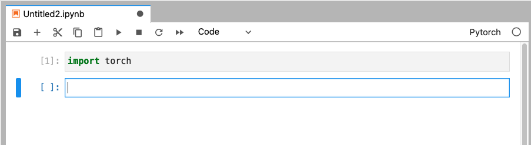

## Pytorch

This page explains how to install the [Pytorch](https://pytorch.org)
package for use with GPUs on the cluster,
and how to use it from Jupyter Notebook via [JupyterHub](https://www.palmetto.clemson.edu/palmetto/jupyterhub_index.html).

### GPU node

1) Request an interactive session on a GPU node. For example:
~~~
$ qsub -I -l select=1:ncpus=16:mem=20gb:ngpus=1:gpu_model=p100,walltime=3:00:00
~~~

2) Load the Anaconda module:
~~~
$ module load cuda/9.2.88-gcc/7.1.0 cudnn/7.6.5.32-9.2-linux-x64-gcc/7.1.0-cuda9_2 anaconda3/2019.10-gcc/8.3.1
~~~

3) Create a conda environment called `tf_env` (or any name you like):
~~~
$ conda create -n pytorch_env pip python=3.8.3
~~~

4) Activate the conda environment:
~~~
$ source activate pytorch_env
~~~

5) Install Pytorch with GPU support from the `pytorch` channel:
~~~
$ conda install pytorch torchvision cudatoolkit=9.2 -c pytorch
~~~

This will automatically install some packages that are required for Pytorch, like MKL or NumPy. To see the list of installed packages, type

~~~
$ conda list
~~~
If you need additional packages (for example, Pandas), you can type

~~~
$ conda install pandas
~~~

6) You can now run Python and test the install:

~~~
$ python
>>> import torch
~~~

Each time you login, you will first need to load the required modules
and also activate the `pytorch_env` conda environment before
running Python:

~~~
$ module load cuda/9.2.88-gcc/7.1.0 cudnn/7.6.5.32-9.2-linux-x64-gcc/7.1.0-cuda9_2 anaconda3/2019.10-gcc/8.3.1
$ source activate pytorch_env
~~~

### Add Jupyter kernel:

If you would like to use Pytorch from Jupyter Notebook on Palmetto via
[JupyterHub](palmetto.clemson.edu/jupyterhub), you need the following additional steps:

1) After you have installed Pytorch, install Jupyter in the same conda environment:

~~~
$ conda install -c conda-forge jupyterlab
~~~

2) Now, set up a Notebook kernel called "Pytorch". For Pytorch with GPU support, do:

~~~
$ python -m ipykernel install --user --name pytorch_env --display-name Pytorch
~~~
  
3) Create/edit the file `.jhubrc` in your home directory:

~~~
$ cd
$ nano .jhubrc
~~~

Add the following two lines to the `.jhubrc` file, then exit.

~~~
module load cuda/9.2.88-gcc/7.1.0 cudnn/7.6.5.32-9.2-linux-x64-gcc/7.1.0-cuda9_2 anaconda3/2019.10-gcc/8.3.1
~~~

4) Log into [JupyterHub](https://www.palmetto.clemson.edu/jupyterhub). Make sure you have GPU in your
selection if you want to use the GPU pytorch kernel

5) Once your JupyterHub has started, you should see the Pytorch kernel in your list of kernels
in the Launcher. 

6) You are now able to launch a notebook using the pytorch with GPU kernel:

