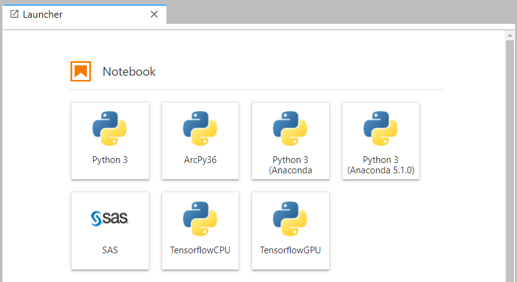

## Tensorflow

This page explains how to install the [TensorFlow](https://www.tensorflow.org/)
package for use with GPUs on the cluster,
and how to use it from Jupyter Notebook via [JupyterHub](https://www.palmetto.clemson.edu/palmetto/jupyterhub_index.html).

This guide is created primarily for TensorFlow 2+. This version of TensorFlow requires AVX2 support 
from CPU, which is not available on the older nodes. Currently Palmetto nodes from **Phase 12 and up** support AVX2. 

We will also include notes on how to setup TensorFlow 1. Since TensorFlow 1 distributions are no 
longer available via pip, the installation instruction will specify local installation pip wheels. 
The current versions available are `1.13.1`, `1.14.0`, and `1.15.0`.  

If you are using codes built using TensorFlow 1, please refer to 
this [migration documentation](https://www.tensorflow.org/guide/migrate) to help with your code. 

### Installing TensorFlow GPU node

1) Request an interactive session on a GPU node. For example:
~~~
$ qsub -I -l select=1:ncpus=24:mem=125gb:ngpus=2:gpu_model=k40:interconnect=10ge,walltime=72:00:00
~~~

2) Load the Anaconda module:
~~~
$ module load anaconda3/2019.10-gcc/8.3.1 cuda/11.0.3-gcc/7.5.0 cudnn/8.0.0.180-11.0-linux-x64-gcc/7.5.0
~~~

3) Create a directory to store the Python virtual environment packages:

~~~
$ mkdir -p ~/software/venv
$ python3 -m venv --system-site-packages ~/software/venv/tf_gpu
~~~

4) Activate the virtual environment:

~~~
$ source ~/software/venv/tf_gpu/bin/activate
~~~

5) Install TensorFlow:

~~~
$ pip install --upgrade pip
$ pip install tensorflow==2.4
~~~

This will automatically install some packages that are required for Tensorflow, like SciPy or NumPy. 
If you need additional packages (for example, Pandas), you can type

~~~
$ pip install pandas
~~~

6) Install TensorFlow Jupyter Kernel:

~~~
$ python3 -m ipykernel install --user --name tf_gpu --display-name TensorflowGPU
$ echo "module load anaconda3/2019.10-gcc/8.3.1 cuda/11.0.3-gcc/7.5.0 cudnn/8.0.0.180-11.0-linux-x64-gcc/7.5.0" >> ~/.jhubrc
~~~

### Installing TensorFlow for non-GPU node

1) Request an interactive session without GPU specification. For example:

~~~
$ qsub -I -l select=1:ncpus=24:mem=125gb:interconnect=10ge,walltime=72:00:00
~~~

2) Load the required modules

~~~
$ module load cuda/10.2.89-gcc/8.3.1
~~~

3) Create a directory to store the Python virtual environment packages:

~~~
$ mkdir -p ~/software/venv
$ python3 -m venv --system-site-packages ~/software/venv/tf_cpu
~~~

4) Activate the virtual environment:
~~~
$ source ~/software/venv/tf_cpu/bin/activate
~~~

5) Install TensorFlow:
~~~
$ pip install --upgrade pip
$ pip install tensorflow==2.4
~~~

This will automatically install some packages that are required for Tensorflow, like SciPy or NumPy. 
If you need additional packages (for example, Pandas), you can type

~~~
$ pip install pandas
~~~

6) Install TensorFlow Jupyter Kernel:

~~~
$ python3 -m ipykernel install --user --name tf_cpu --display-name TensorflowCPU
~~~

### Install TensorFlow 1

This example is for tensorflow version `1.15.0`. You can change it with `1.14.0` or `1.13.1` files:

~~~
$ ls -l /zfs/citi/tf_downloads/
total 1641262
-rw-r--r-- 1 lngo citi  39765989 Nov  9  2016 tensorflow-0.11.0-cp27-none-linux_x86_64.whl
-rw-r--r-- 1 lngo citi  92637477 Feb 26  2020 tensorflow-1.13.1-cp37-cp37m-manylinux1_x86_64.whl
-rw-r--r-- 1 lngo citi 109275882 Feb 26  2020 tensorflow-1.14.0-cp37-cp37m-manylinux1_x86_64.whl
-rw-r--r-- 1 lngo citi 412289319 Feb 26  2020 tensorflow-1.15.0-cp37-cp37m-manylinux2010_x86_64.whl
-rw-r--r-- 1 lngo citi 344955697 Feb 26  2020 tensorflow_gpu-1.13.1-cp37-cp37m-manylinux1_x86_64.whl
-rw-r--r-- 1 lngo citi 377100278 Feb 26  2020 tensorflow_gpu-1.14.0-cp37-cp37m-manylinux1_x86_64.whl
-rw-r--r-- 1 lngo citi 411506559 Feb 26  2020 tensorflow_gpu-1.15.0-cp37-cp37m-manylinux2010_x86_64.whl
~~~

1) GPU

~~~
$ qsub -I -l select=1:ncpus=16:mem=62gb:ngpus=2:gpu_model=k20:interconnect=10ge,walltime=72:00:00
$ module purge
$ module load cuda/10.0.130-gcc/7.1.0 cudnn/7.4.1.5-10.0-linux-x64-gcc/8.3.1 anaconda3/2019.10-gcc/8.3.1
$ mkdir -p ~/software/venv
$ python3 -m venv --system-site-packages ./software/venv/tf1_gpu
$ source ~/software/venv/tf1_gpu/bin/activate
$ pip install --ignore-install /zfs/citi/tf_downloads/tensorflow_gpu-1.15.0-cp37-cp37m-manylinux2010_x86_64.whl
$ python3 -m ipykernel install --user --name tf1_gpu --display-name Tensorflow_1_GPU
~~~

2) CPU

~~~
$ qsub -I -l select=1:ncpus=16:mem=62gb:interconnect=10ge,walltime=72:00:00
$ module purge
$ module load anaconda3/2019.10-gcc/8.3.1
$ mkdir -p ~/software/venv
$ python3 -m venv --system-site-packages ./software/venv/tf1_cpu
$ source ~/software/venv/tf1_cpu/bin/activate
$ pip install --ignore-install /zfs/citi/tf_downloads/tensorflow-1.15.0-cp37-cp37m-manylinux2010_x86_64.whl
$ python3 -m ipykernel install --user --name tf1_cpu --display-name Tensorflow_1_CPU
~~~

### Test TensorFlow Jupyter Kernels

1) Log into [JupyterHub](https://www.palmetto.clemson.edu/jupyterhub). Make sure you have GPU in your
selection if you want to use the GPU TensorFlow kernel

2) Once your JupyterHub has started, you should see the TensorFlow kernels in your list of kernels
in the Launcher.

3) You are now able to launch a notebook using the one of the TensorFlow with GPU kernel:

For Tensorflow with GPU support, the notebook cell containing `tf.config.list_physical_devices('GPU')`
will produce a non-empty list. 

### Setup Tensorboard

TensorFlow 2+ has `tensorboard` included with the installation package. To run TensorBoard, 
you can leverage the same notebook server. 

1) Click the `+` sign near the top left corner of the Jupyter Lab interface to open the Launcher. 
Select a Terminal. 

2) Run the following commands (assuming a `tf_gpu` installation.)

~~~
$ module load anaconda3/2019.10-gcc/8.3.1 cuda/11.0.3-gcc/7.5.0 cudnn/8.0.0.180-11.0-linux-x64-gcc/7.5.0
$ source ~/software/venv/tf_gpu/bin/activate
$ tensorboard --logdir logs --host 0.0.0.0
~~~

Pay attention to your allocated Palmetto node, as highlight by the red shape in the above
image. 

3) Follow the instructions shown in [Socket Proxy Access](https://www.palmetto.clemson.edu/palmetto/advanced/proxy/) to setup proxy access from your local computer. Open the Firefox browser and go to the node from step
2 at port 6006

### Example Deep Learning - Multiple Object Detections

This is a demonstration for the tensorflow gpu kernel. Steps for
non-gpu kernel are similar.

1) Request an interactive session on a GPU node. For example:
~~~
$ qsub -I -l select=1:ncpus=16:mem=20gb:ngpus=1:gpu_model=p100,walltime=3:00:00
~~~

2) Load the Anaconda module:
~~~
$ module load cuda/10.2.89-gcc/8.3.1 cudnn/8.0.0.180-10.2-linux-x64-gcc/8.3.1 anaconda3/2019.10-gcc/8.3.1
~~~

3) Activate the conda environment:
~~~
$ source activate tf_gpu_env
~~~

4) Install supporting conda modules:

~~~
$ conda install Cython contextlib2 pillow lxml matplotlib utils pandas
~~~

5) Setup TensorFlow's Model directory:

~~~
$ cd
$ mkdir tensorflow
$ cd tensorflow
$ wget https://github.com/tensorflow/models/archive/master.zip
$ unzip master.zip
$ mv models-master models
$ module load protobuf/3.11.2-gcc/8.3.1
$ cd models/research
$ protoc object_detection/protos/*.proto --python_out=.
$ cp object_detection/packages/tf2/setup.py .
$ python -m pip install --user --use-feature=2020-resolver .
$ cd ~/tensorflow
$ cp /zfs/citi/deeplearning/multi_object.ipynb .
~~~

Open Jupyter Server, change into the `tensorflow` directory, then open and run
the `multi_object.ipynb` notebook.
